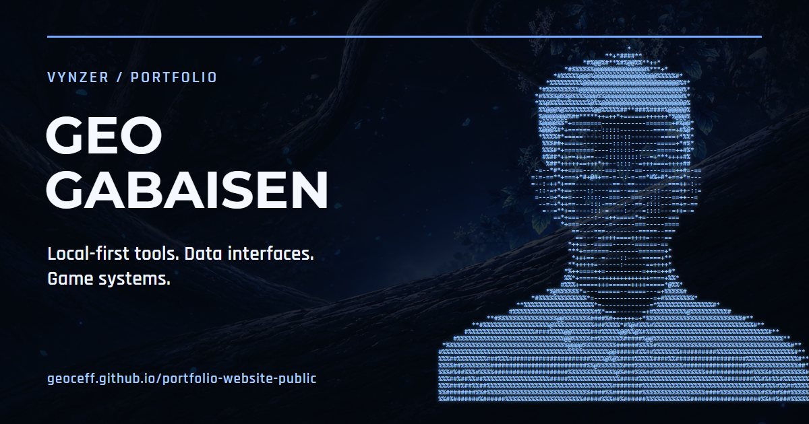

<p align="center">
  
</p>

<h1 align="center">Geo Gabaisen Portfolio</h1>

<p align="center">
  A blue-lumina personal portfolio for Geo Ceff Vinzr H. Gabaisen, built around shipped projects,
  data interfaces, game systems, automation, and practical software work.
</p>

<p align="center">
  <a href="https://geoceff.github.io/portfolio-website-public/"><strong>Live site</strong></a>
  ·
  <a href="https://github.com/GeoCeff">GitHub</a>
  ·
  <a href="https://www.linkedin.com/in/geo-ceff-vinzr-gabaisen-43214a339/">LinkedIn</a>
  ·
  <a href="mailto:ghgabaisen@up.edu.ph">Email</a>
</p>

<p align="center">
  
  
  
  
</p>

---

## Signal

This repository is the public release of the portfolio site. The design mirrors the live experience:
deep midnight panels, blue glow accents, animated route titles, image-forward project cards, and a
portfolio voice that mixes polished proof with a little personality.

| Section | What it carries |
| --- | --- |
| Home | Intro, current focus, biography, experience, education, and project previews |
| About | Personal notes, values, hobbies, and an expandable writing area |
| Projects | Game systems, data tools, browser utilities, automation, and web work |
| Skills | Project-backed skill groups with evidence notes |
| Contact | Social links, resume download, and collaboration paths |

## Stack

```txt
Next.js 16 App Router
React 19
TypeScript
Plain CSS
Lucide React
React Icons
GitHub Actions
GitHub Pages
```

## Run Locally

```bash
npm install
npm run dev
```

Open `http://localhost:3000`.

## Checks

```bash
npm run lint
npm run build
```

## Source Map

```txt
app/siteData.ts        profile, education, skills, personal notes, contact links
app/projectData.ts     featured and detailed project entries
app/about/posts.ts     expandable writing entries
app/globals.css        visual system, motion, layout, responsive behavior
app/paths.ts           GitHub Pages base-path helper
public/                images, logos, resume, social preview
```

## Deployment

This public repo deploys with GitHub Pages from GitHub Actions.

```txt
Repository: GeoCeff/portfolio-website-public
Base path:  /portfolio-website-public
Live URL:   https://geoceff.github.io/portfolio-website-public/
```

Set **Settings > Pages > Build and deployment > Source** to **GitHub Actions**.
Push to `main`; the workflow builds a static export and deploys `out/`.
